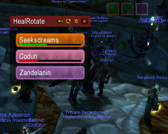

# HealRotate

This addon is meant to help healers to setup a healign rotation and give them real time visual feedback about it.
This is intended to help on Lothab in Naxx.
It also allow non-healer raid leaders to easily manage, report and watch the heal rotation live. 
Even if none of your healers use the addon! 

This is based off of TranqRotate initialy published by Slivo-fr : https://github.com/Slivo-fr/HealRotate

## Feedback

Please report any issue using github issues : https://github.com/raven-in-westfall/HealRotate/issues

## Features

- Automatically send messages to notify others player about your heal
- Show cast time of heals
- Display the list of raid healers
- Allow player to re-order players between two groups : main rotation and backup
- Synchronize rotation order between player using the addon
- Whisper backup healers (if there is backup) or next rotation healer if you miss your healshot
- Provide a real time visual feedback about the rotation status, even if no one else use the addon in your raid
- Synchronize healshot casts to other player using the addon
- Allow player to broadcast the configured rotation and backup group to the raid
- Display offline and dead status on healers frames
- Play a sound when you are next on rotation
- Show an alert and play a sound when you need to use your heal
- Display the heal cooldown of each healer

## Usage
 
Use `/heal` for options

You must be in a raid for healers to get registered and displayed by the addon.

First step is to setup your heal rotation using drag & drop on healers, if others healers use the addon too, changes will be synced. 
You may use the trumpet button to report the rotation in raid chat so others players without the addon can know what you planned. 
Please note the backup group is hidden if empty but you can still drag healers into it.

You can now just pull the boss and start healing, HealRotate will track the rotation and use a purple color on the next healer that should heal. HealRotate will play sounds when the previous healer healed and you are the next.

**Warning** : if all of your healers does not use the addon, make sure someone with the addon stays within 45m range of healers without the addon or you won't be able to register their rotation.

You can use the reset button in the top bar to reset the rotation state if it does not clear itself.
The reset button is also able to resync raid healers and rotation setup if you need.

You may adds the `/heal backup` command to a macro that you can use when you are unable to heal and you need some help,
It will whisper all backup healers the fail message.

## Roadmap

Here is a list of feature I want to implement at some point, no specific order is decided yet.

- Adds RL/Raid assist handling to restrict rotation groups changes
- Roll in shaman support
- Change active healer color
- Get cast bar to reflect actual times of spells. Right now we are just using the base cast time which may be altered by skills or trinkets

## Download

Do not use github download button on this page, get the latest release zip file from https://github.com/raven-in-westfall/HealRotate/releases

Might be available on curseforge someday...
